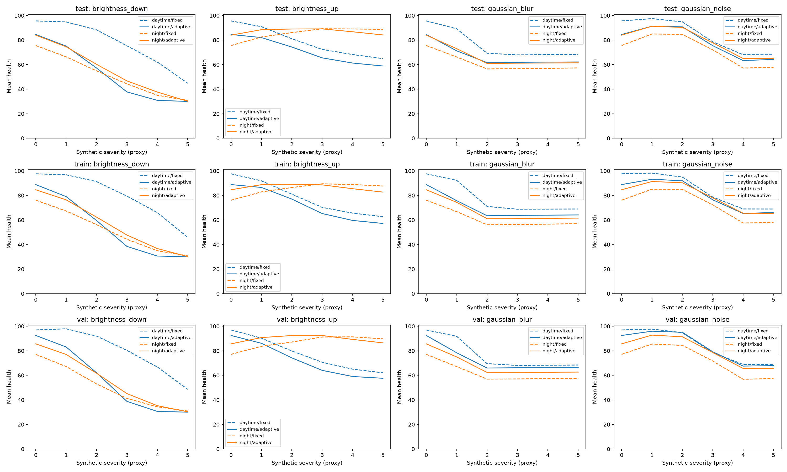

# Bằng chứng benchmark nhóm — integration_20261006_01

Đây là bản chọn lọc từ lượt chạy thật ngày 06/10/2026 (Asia/Saigon), không phải benchmark mới. [Báo cáo nhóm](../../../report.md) và các báo cáo cá nhân sử dụng cùng evidence này.

## Mở bằng chứng

| Cần kiểm tra | File |
| :--- | :--- |
| Bảng chính fixed/adaptive, severity, số mẫu | [curves.csv](evaluation/curves.csv) |
| Mean, median, population standard deviation | [groups.csv](evaluation/groups.csv), [split_totals.csv](evaluation/split_totals.csv) |
| Điểm từng frame và ngoại lệ tăng điểm | [samples.csv](evaluation/samples.csv), [score_increases.csv](evaluation/score_increases.csv) |
| Feature benchmark người 3 | [member3_feature_summary.csv](evaluation/member3_feature_summary.csv), [provenance + IDs](evaluation/member3_feature_summary_provenance.json) |
| Lệnh thực chạy, runtime, source/input hashes | [provenance.json](evaluation/provenance.json) |
| Verify/replay theo từng phase | [audit/report.md](audit/report.md), [summary.json](audit/summary.json), [phase 1](audit/phase_1.json), [phase 2](audit/phase_2.json), [phase 3](audit/phase_3.json), [phase 4](audit/phase_4.json), [phase 5](audit/phase_5.json) |
| Generation và config | [run_summary.json](generation/run_summary.json), [config_snapshot.json](generation/config_snapshot.json) |
| Handoff và config/reference frozen | [handoff.json](snapshots/handoff.json), [references.json](snapshots/references.json) |
| Nguồn bản chia sẻ và checksum | [export_index.json](export_index.json) |



Plot được sao chép nguyên file từ output. Severity 0 là original; 1–5 là corruption synthetic trên cùng parents. Các mức sigma/gain và đơn vị nằm trong config snapshot. Bảng brightness_down trong báo cáo nhóm là số đo chính: 34 test daytime parents và 26 night parents, mỗi mức dùng cùng parents. CSV giữ số đầy đủ; health là điểm 0–100, không phải accuracy/confidence.

## Dữ liệu, phương pháp và kết quả

Dataset: [BDD100K](https://github.com/bdd100k/bdd100k), 300 ảnh thật source_split=val; lab train/val/test=180/60/60 originals. Bốn corruption × năm severity tạo 6.000 synthetic, tổng 6.300 records (train/val/test=3.780/1.260/1.260). Synthetic severity và weather/timeofday không phải nhãn quality; sequence provenance chưa được xác minh độc lập.

Nhóm tự triển khai heuristic từ bảy feature RGB uint8 640×360, reference median/MAD của 20 original train (10 day, 10 night). Fixed dùng tất cả reference; adaptive chọn theo metadata. H=100×(1−0,3Psharpness−0,3Pexposure−0,3Pnoise−0,1Pentropy), weight=(H/100)²; action thresholds 75/45. Giữ mặc định sau review val, freeze trước test. [Paper tham khảo v3](https://arxiv.org/abs/2112.05456v3) và [repo tác giả](https://github.com/MaikWischow/Camera-Condition-Monitoring) không phải nguồn số đo nhóm và chưa được nhóm tái chạy estimator ML.

Test original adaptive mean=84,31; test synthetic mean=66,38. Bảng brightness_down daytime adaptive giảm 84,54→30,00 từ original đến gain 0,12. Không có quality labels hoặc detector AP để kết luận adaptive chính xác hơn fixed.

Audit cũ: verify 6.000 synthetic; replay pixel **120/120** variants; tính lại từ ảnh **145** feature records, max difference=0; recalibrate 20 reference và recompute **6.300** health records; năm CSV evaluation byte-identical. Phase 1 chỉ xác minh delivery; chưa replay selection/split/QC vì code/config chuẩn bị data của người 1 chưa được bàn giao. Các log là output integrator, không suy ra mỗi owner tự chạy trên máy mình.

## Một failure case và quyết định


Ảnh test original `b329fe7d-f06455d3` có nội dung giống cảnh đêm nhưng metadata nguồn ghi daytime; handoff khớp nguồn local. Median luminance=21/255; fixed=82,07, adaptive day=38,66, chênh lệch −43,41 điểm. Adaptive exposure penalty trừ 30 điểm; action chuyển thành strong_down_weight. [Diagnostics](evaluation/selected_failure_explanation.json) giữ từng penalty. Không tự sửa metadata hoặc tune theo test.

Quyết định: cần review độ tin cậy metadata/reference trước khi routing adaptive. Metadata-quality gate là **đề xuất chưa triển khai**; fallback hiện có chỉ cho dawn/dusk/undefined. Cần nhãn quality độc lập và benchmark detector trước khi dùng score cho ADAS/robot/drone. Fixed cũng chưa phải fallback an toàn được chứng minh.

## Kiểm tra được từ GitHub clone

Các snapshot feature/health/manifest đã được công bố để kiểm tra số đo mà không tải tất cả ảnh:

```powershell
python -m venv .venv
.\.venv\Scripts\python.exe -m pip install -r requirements.txt
.\.venv\Scripts\python.exe scripts/verify_published_evidence.py
```

Linux/macOS dùng `.venv/bin/python`. Lệnh kiểm tra checksum các artifact, schema/coverage, tính lại health từ feature/ref frozen, kiểm tra freeze evidence và 12 nhóm bảng chính từ điểm từng frame. Lệnh không tái trích feature từ ảnh. [Kết quả kiểm tra bản công bố](publication_verification.json).

## Lệnh thực chạy và giới hạn tái hiện

```powershell
.\.venv\Scripts\python.exe src/run_pipeline.py prepare --run-id integration_20261006_01
.\.venv\Scripts\python.exe src/run_pipeline.py finalize --run-id integration_20261006_01 --validation-note "Nội dung review thực tế" --reference-review-note "Nội dung review reference thực tế"
.\.venv\Scripts\python.exe scripts/audit_real_run.py --run-id integration_20261006_01 --evidence-id evidence_20261006_01
```

Hai note trên là chỗ minh họa; argv đầy đủ đã thực thi nằm trong provenance.json. Muốn chạy lại từ ảnh: tải BDD100K, khôi phục handoff tại các đường `data/` ghi trong export index và dùng run_id/evidence_id mới, review val thật trước finalize. Ảnh dataset toàn bộ và 6.000 PNG không nằm trong Git; image replay cần chúng. Các ảnh minh họa trong bundle gồm một failure original và các contact sheet từ BDD100K, dùng để minh họa kết quả nhóm, không phải dataset đầy đủ.

Code công bố: [c29e8f9](https://github.com/Munfond/K4-Track4-Day04-Midfeed-Sensor-Reality-Sprint/commit/c29e8f994da629d935f95bb167e8073dfe58cc25). Lượt chạy lịch sử diễn ra ở HEAD `0917990` khi code integration còn uncommitted; provenance giữ đúng trạng thái đó và module hashes, không đổi lịch sử thành một lượt chạy ở commit mới.

CSV/PNG/JPG/JSONL được sao chép nguyên byte. Một số JSON bỏ prefix thư mục máy cá nhân và serialize lại; số đo, hash, timestamp, argv và trạng thái Git lịch sử được giữ. export_index.json ghi source hash, published hash và phép biến đổi từng file. Snapshot gốc local không thay đổi. Đường ảnh trong manifest vẫn chỉ đến dataset local. Hash source và hash bản đã đổi đường dẫn có thể khác; không dùng hash bản chia sẻ thay cho hash input của lượt chạy.

Tái xuất evidence: `python scripts/export_benchmark_evidence.py --update-docs`, sau đó chạy verifier. Khi tái dựng report bằng build_group_report.py, chạy exporter tiếp để chuyển các link sang bản công bố. Bản chia sẻ không có nhãn chất lượng, F1/AP hoặc bằng chứng độ tin cậy điều khiển xe.
